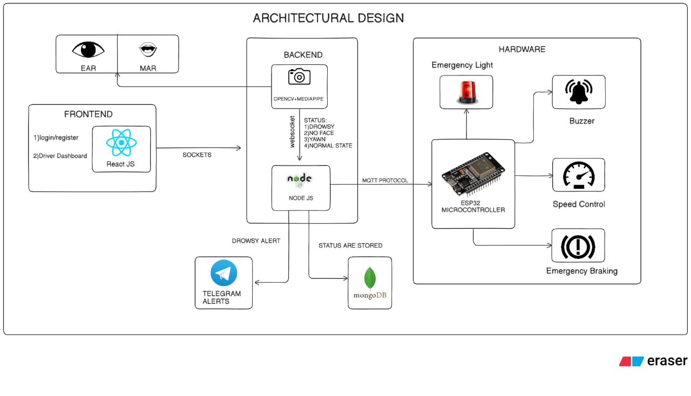

# AI-Based Driver Drowsiness Detection

## AI + IoT System for Real-Time Drowsiness Detection and Automated Safety Response

## Problem Statement

Driver drowsiness is one of the major causes of road accidents. Most existing systems only give an alarm when the driver becomes drowsy. Our project not only detects drowsiness using AI but also takes safety actions automatically using IoT, such as reducing vehicle speed, applying emergency braking, and sending alerts.

## Objective

- Monitor the driver's face in real time.
- Detect drowsiness using facial features.
- Alert the driver immediately.
- Notify concerned people remotely.
- Trigger hardware safety mechanisms like emergency lights, buzzer, speed reduction, and emergency braking.

## System Modules

### 1. AI Detection Module

**Technologies**
- Python
- OpenCV
- MediaPipe

**Responsibilities**
- Capture live video from the webcam.
- Detect the driver's face.
- Calculate EAR (Eye Aspect Ratio) for eye closure.
- Calculate MAR (Mouth Aspect Ratio) for yawning.
- Determine the driver's state:
  - Normal
  - Drowsy
  - Yawn
  - No Face
- Send the detected status to the backend.

### 2. Backend Server

- Built using Node.js.
- Receives the driver's status from the AI module.
- Sends live updates to the React dashboard using WebSockets.
- Stores detection history in MongoDB.
- Sends Telegram notifications when required.
- Publishes commands to the ESP32 through MQTT.

### 3. Frontend

- Developed with React.js.
- User login and registration.
- Driver monitoring dashboard.
- Real-time driver status displays.
- Live alerts and notifications interface.

### 4. Database

- Utilizes MongoDB database.
- Stores Driver IDs and detection status.
- Logs precise time of detection.
- Records EAR and MAR values.
- Maintains comprehensive alert history.

### 5. Notification System

- Powered by Telegram Bot API.
- Sends Telegram messages to the driver's family during critical events.
- Notifies the fleet manager immediately.

### 6. Hardware Module

**Controller**
- ESP32
- Receives commands from Node.js through MQTT and performs safety actions.

  

## Hardware Safety Logic

Our system follows a three-level safety mechanism rather than taking immediate action. When drowsiness is detected for the first time, the ESP32 activates a buzzer to alert the driver. If the driver remains drowsy and a second consecutive detection occurs, the system reduces the vehicle's speed while continuing the warning. If the driver still does not respond, the situation is treated as critical: the ESP32 applies emergency braking and turns on the emergency warning lights, while the Node.js server sends Telegram notifications to the driver's family and fleet manager and stores all event details in MongoDB.

This staged approach avoids unnecessary emergency braking while giving the driver multiple opportunities to regain control.
| Stage | Actions Taken |
|---|---|
| **1st Detection** | Buzzer ON |
| **2nd Consecutive Detection** | Reduce vehicle speed Continue buzzer |
| **Driver Still Unresponsive (Critical)** | Emergency braking applied Emergency lights ON Telegram alert sent to family & fleet manager Event stored in MongoDB |

## Complete Workflow

1. The webcam captures the driver's face.
2. OpenCV and MediaPipe process the video and calculate EAR and MAR.
3. The AI module determines the driver's status.
4. The status is sent to the Node.js backend.
5. Node.js:
   - Updates the React dashboard.
   - Stores the status in MongoDB.
   - Sends MQTT commands to the ESP32.
6. The ESP32 performs the appropriate safety action based on the level of drowsiness.
7. If the situation becomes critical, Telegram notifications are sent to the driver's family and manager.

